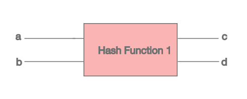

# HashMap深思探索

## HashMap的默认容量

在栈中构建HashMap的过程中，如果未制定其初始容量大小，其默认的大小为16。下面给出HashMap的三个构造函数

```java
public HashMap() {
    this.loadFactor = DEFAULT_LOAD_FACTOR; // 不传入任何参数，默认的负载因子为0.75，默认容量为16
}
public HashMap(int initialCapacity) {
        this(initialCapacity, DEFAULT_LOAD_FACTOR); // 让用户可以指定初始大小，但是负载因子默认还是设置为0.75
}
public HashMap(int initialCapacity, float loadFactor) // 可以让用户指定初始大小和负载因子
```
## 什么又是负载因子？

**负载因子**用于决定HashMap的容量不够时，何时进行扩容，这个扩容的时机决定了**容量**和**速率**的综合考量。

因为如果HashMap里元素放满了再扩容，那必然其Hash碰撞率也会很高，因此很容易出现**链化**的情况。


## 扩容机制

构建完HashMap之后，如果一直向容器中put元素，那么这个数据结构会不断增大。如果初始大小为16，则当其内部大小达到了16*0.75=12个元素时，那么HashMap就会进行一个扩容。具体就是：将桶中的原有元素进行rehash,然后copy到新的桶中。

## 为什么是在12的时候进行扩容

### 1、为了解决Hash碰撞问题

如图所示：
- 如果c!=d,那么a和b一定不相等；
- 如果c=d,那么a和b可能想等也可能不等。
一个设计良好的Hash函数，应该是尽量减少出现相同哈希值的情况，也就是hash碰撞的概率足够低。



### 2、如何解决Hash碰撞问题

1、扩容： 容量太小，Hash值有限，那么碰撞的概率自然很大

2、hash算法优化

## 负载因子为什么是0.75
｜；
负载因子影响的是HashMap在何时进行扩容。
- 情景一： 如果负载因子为0.5，HashMap的默认初始大小为16，那么容器的扩容机制发生在: 16*0.5=8,也就是存入了8个元素时，进行resize，没个元素重新rehash之后，copy到新的内存地址中。
- 情景二：如果负载因子为1，HashMap的默认初始大小为16，那么容器的扩容机制发生在: 16*1=16,也就是存入了16个元素时，进行resize，没个元素重新rehash之后，copy到新的内存地址中。

### 优劣性

- 情景一可以很大程度上减少Hash碰撞的概率，但是太浪费存储空间了
- 情景二可以很大程度上节省内存，但是碰撞概率高，容易出现退化为链表的情况，大大增加了查询效率

## 结论

通过对内存和速度的tradeoff，也就是衡量，0.75是在速度和内存的择中和最优选择