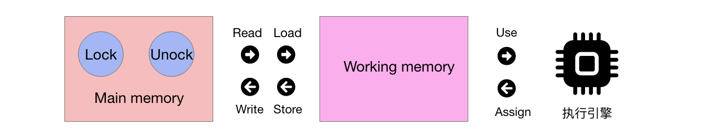

# Java 内存模型

## 概念

Java内存模型是以JSR形式进行维护的一种规范，用于屏蔽各种硬件和操作系统的内存访问差异，以实现Java程序可以在各个平台上都能达到一致的内存访问效果。操作系统的概念放到了虚拟机中，屏蔽了不同硬件的差异。

该内存模型主要也就是定义了程序中各种变量的访问规则，关注点在于**虚拟机中把变量值存储到内存中和从内存中取出变量值类似的底层细节**。

如下图所示，Java内存模型规定了所有的变量都存储在主内存中(Main memory)，每条线程有自己的工作内存，**工作内存中保留了该线程使用的变量的工作内存的副本**，线程对变量的所有操作，全都限定在工作内存中进行，不能直接读写主内存中的数据，线程间变量值的传递，必须通过主内存才能完成。

## 内存间交互操作
内存间操作主要是定义了变量如何从主内存copy到工作内存中，以及将工作内存中的数据同步到主内存中的实现细节。

这些操作由8种组成，而且都是原子性且不可分割的，主要分为：
- lock
- unlock
- read
- load
- assign
- store
- write

如下图所示，要想将变量从主内存读取到执行引擎中，必须经过Read、Load以及Use；相反，执行引擎中的变量想要写回到主内存中，必须经过Assign、Store和Write。特别的是，Read和Load、Write和Store必须成对出现，新的变量只能最初诞生于主内存中。

对于Lock操作，一条线程可以对主内存中的变量执行多次，但是需要执行相同次数的unlock，才能变量才会解锁。对一个变量执行Lock时，会清空Working memory中此变量的值。需要unlock一个变量，首先需要从执行引擎-〉Assign->Working memory -> Store -> Write -> 主内存， 因为只有在主内存中才能unlock。

## volatile变量与内存模型
### 什么是volatile变量？
当变量被定义为volatile时，该变量讲存在两种特性：
- 该变量对所有线程皆可见，变量值只要被修改，其他线程能够立即得知。而普通变量的值的改变需要通过主内存进行传递才能得知
- 第二层特性为禁止指令重排序优化

### 误区
变量值只要被修改，其他线程能够立即得知，并不能得出volatile变量在各个线程中都是一致的，因此也**无法判断该变量在并发下是线程安全的**。